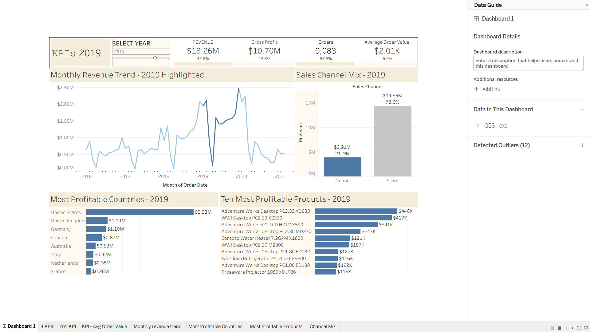

# Global Electronics Store — Sales Analytics & Data Science Portfolio

## Project overview

This project demonstrates an end-to-end analytics workflow using **Snowflake, SQL, Python, Tableau and AI-assisted development**. Starting from raw relational sales data, I prepared and validated the data, built business KPIs and an interactive dashboard, and extended the analysis with forecasting and interrupted time-series modelling.

### Analytical workflow

**Raw data → → SQL transformation in Snowflake → Tableau dashboard → Python analysis → Business recommendations

1. **Data preparation — Snowflake & SQL**  
   Imported, cleaned and joined sales, product, customer, store and exchange-rate data. Created analytical variables, KPI measures and data-quality checks.

2. **Business intelligence — Tableau**  
   Built an interactive executive dashboard covering revenue, gross profit, orders, average order value, channel mix, geographic performance and product performance.

3. **Statistical analysis — Python**  
   Analysed the sharp 2020 revenue decline using forecast benchmarks and interrupted time-series analysis to identify when and how performance changed.

4. **Interpretation — Business recommendations**  
   Translated the analytical results into management priorities around product availability, channel performance, geographic exposure and assortment management.

5. **AI-assisted workflow**  
   Used AI tools for code review, debugging, validation and faster iteration. The core SQL analysis was written manually to strengthen my SQL skills, while AI assistance was used where it could improve efficiency.

## Executive summary

This portfolio project turns 62,884 sales line items into an executive view of revenue, profitability, order volume, average order value, channel mix, geography, and product performance.

The latest complete year is **2020**. Revenue fell to **$9.29M (-49.1% year over year)** and gross profit to **$5.45M (-49.1%)**, while distinct orders declined to **4,635 (-49.0%)**. Average order value remained almost unchanged at **$2,005 (-0.3%)**, and gross margin stayed stable at **58.6%**. The revenue decline was driven primarily by fewer orders. Average revenue per order and aggregate gross margin remained broadly stable, although changes in pricing and product mix may offset one another.

The timing of the decline closely coincides with the beginning of the global COVID-19 disruption. Revenue was still above 2019 levels in January and February 2020 before falling sharply from March onward. The World Health Organization (WHO) characterized COVID-19 as a pandemic on **11 March 2020**, which is why March is used as the interruption point in the analysis. The timing and magnitude of the break are consistent with a substantial pandemic-related disruption, but the available observational data cannot establish that COVID-19 was the sole cause.

From March through December 2020, actual revenue was **$5.00M**, compared with an **$18.92M growth-trend benchmark**, leaving a **$13.92M scenario gap (-73.6%)**. A more conservative seasonal-naive benchmark gives **$14.22M**. An interrupted time-series analysis also identifies a large break around March 2020 after accounting for the previous revenue trend and seasonal patterns.

The analysis suggests focusing on product availability and fulfilment, recovering order volume across store and online channels, protecting the US core market, and managing inventory and promotions at product-family level.

## Dashboard at a glance

The Tableau dashboard includes:

- Four year-selectable KPI cards: revenue, gross profit, distinct orders, and average order value.
- A channel-mix view comparing online and store sales.
- A monthly revenue trend across the full sample period.
- Profit comparisons by customer country and product model.
- A **Selected Year** parameter covering 2016–2020.

The dashboard defaults to 2020, while earlier complete years can also be selected. Data for 2021 ends on 20 February and is therefore treated as year-to-date rather than compared with full years. As the project was built with Tableau Public, the repository includes a dashboard screenshot, a twbx Tableau workbook and a short description of the workflow.

## Business questions

1. How are revenue, gross profit, order volume, and average order value changing year over year?
2. Is performance mainly driven by volume, basket size, or margin?
3. How resilient is the online channel compared with stores?
4. Which countries and product models contribute the most profit?
5. Where should management focus recovery efforts?

## Headline findings

### 1. Growth through 2019 was driven by order volume

From 2016 to 2019, revenue increased from **$6.95M to $18.26M** and distinct orders from **2,865 to 9,083**. Over the same period, average order value declined from **$2,425 to $2,011**. Growth therefore came mainly from more transactions rather than higher order values.

### 2. The 2020 decline was almost entirely an order-volume shock

| KPI | 2019 | 2020 | YoY |
|---|---:|---:|---:|
| Revenue | $18.26M | $9.29M | -49.1% |
| Gross profit | $10.70M | $5.45M | -49.1% |
| Distinct orders | 9,083 | 4,635 | -49.0% |
| Average order value | $2,011 | $2,005 | -0.3% |
| Gross margin | 58.57% | 58.61% | +0.04 pp |

Revenue was still above 2019 levels in January (+6.6%) and February (+5.9%). The decline began after February and intensified later in the year; October and November revenue were approximately 84% and 85% below the same months in 2019.

The dataset establishes the timing of the decline but not its cause. Operational data would be needed to distinguish between weaker demand, supply constraints, product availability, and store-access effects.

### Forecast benchmark and interrupted time-series analysis

The analysis uses **60 complete monthly observations from January 2016 through December 2020**, with March 2020 treated as the interruption point. The World Health Organization (WHO) characterized COVID-19 as a pandemic on **11 March 2020**, providing a clear external reference point for the timing of the analysis.

Several forecasting approaches were compared using pre-COVID holdout periods and **weighted mean absolute percentage error (WMAPE)**, which measures forecast error relative to total actual revenue. A simple model using log monthly revenue, a time trend, and calendar-month effects performed best overall and was selected as the main benchmark.

Fitted to the **50 months through February 2020**, the model estimates a historical annual growth trend of **38.0%**. For March through December 2020, it predicts **$18.92M** in revenue compared with **$5.00M actual revenue**, leaving a **$13.92M gap (73.6%)**.

A more conservative comparison based on the previous year's seasonal pattern gives a benchmark of **$14.22M**, corresponding to a **$9.22M gap (64.9%)**. These figures should be interpreted as scenario comparisons rather than revenue proven to have been lost because of COVID-19.

The interrupted time-series regression controls for the pre-existing trend and month-of-year effects. It estimates:

- A pre-March 2020 trend of **+$28,118 per month**.
- An immediate adjusted level change of **-$614,573** in March 2020 (`p < 0.001`; 95% confidence interval approximately **-$754K to -$475K**).
- A subsequent monthly trend change of **-$140,670** (`p < 0.001`).
- An estimated post-March trend of **-$112,552 per month**.

The ITS no-interruption curve is a **separate regression scenario**, not the $18.92M forecast benchmark. 

Both approaches identify a large break around March 2020. Combined with the timing of the pandemic and the sharp change after February, the results are consistent with substantial COVID-19-related disruption. However, the observational data cannot establish how much of the decline was caused specifically by the pandemic.

### 3. Online gained share but did not grow

Online revenue fell **47.0%** to **$2.07M**, while store revenue fell **49.7%** to **$7.22M**. Online share increased by only **0.87 percentage points**, from 21.40% to 22.27%.

The online channel was relatively more resilient, but its absolute decline means the higher share should not be interpreted as online growth.

### 4. Profit is geographically concentrated

The United States generated **$5.27M in revenue** and **$3.08M in gross profit** in 2020, representing 56.7% of company revenue. The United States, United Kingdom, and Germany together contributed **76.7% of revenue** and **76.6% of gross profit**.

All eight markets declined versus 2019. The United States recorded the largest absolute gross-profit decline (**-$2.85M**), while France had the smallest percentage decline (**-29.8%**). This suggests protecting the US profit base while testing focused recovery measures in comparatively resilient secondary markets.

### 5. Product profit is diversified, led by computers

Computers generated **$3.67M in revenue** and **$2.15M in gross profit** in 2020, making them the largest category. The category also recorded the largest absolute gross-profit decline at **-$1.91M**.

The leading product model was **Adventure Works Desktop PC2.33 XD233**, generating approximately **$205K in gross profit**. Product names are grouped without colour so equivalent models are analysed together.

The top five models contributed only **13.3% of total gross profit**, and the leading model accounted for **3.8%**, suggesting that profit is spread across a broad product range rather than concentrated in a few products.

## Recommended management actions

1. **Protect product availability.** Prioritize high-demand, high-margin product families when inventory is constrained. Add stock-out, supplier lead-time, cancellation, and delivery-reliability data to distinguish weak demand from product-availability problems.

2. **Recover order volume across store and online channels.** Use stores and online channels together to improve customer access and rebuild transactions. Track absolute online orders, revenue, cancellations, and delivery performance rather than online share alone.

3. **Protect the US core market.** The US generated 56.7% of 2020 revenue and recorded the largest absolute profit decline. Prioritize recovery efforts there while testing targeted strategies in comparatively resilient secondary markets.

4. **Improve assortment and cash efficiency.** Manage demand at product-family level, reduce slow-moving variants, and protect gross margin through targeted rather than broad promotions. Use the forecast scenarios as planning references rather than sales targets.
## KPI definitions

| KPI | Definition |
|---|---|
| Revenue | Sum of `REVENUE_USD` for the selected year |
| Gross profit | Sum of `GROSS_PROFIT_USD` for the selected year |
| Distinct orders | `COUNTD(ORDER_NUMBER)` for the selected year |
| Average order value | Revenue divided by distinct orders |
| Gross margin | Gross profit divided by revenue; used as a diagnostic rather than a headline card |
| Online revenue share | Online revenue divided by total revenue |
| YoY change | Selected-year value divided by previous-year value, minus one |

## Data and methodology

- **Source:** Mock data from Maven Analytics, provided as separate CSV files for sales, products, customers, stores, and related tables.
- **Data preparation:** Cleaned and merged in Snowflake using SQL in Snowsight.
- **Coverage:** **1 January 2016–20 February 2021**.
- **Validated records:** **62,884 line items** and **26,326 distinct orders**.
- **Complete annual periods:** **2016–2020**; February 2021 is partial.
- **Forecasting period:** **January 2016–December 2020**, excluding incomplete 2021 data.
- **Forecast selection:** Five specifications were compared using a 12-month pre-COVID holdout. Four partly overlapping rolling-origin tests then compared the simple growth model with seasonal naive. The simple model performed better in three of four windows, with **26.1% pooled WMAPE** versus **33.0%**.
- **Growth-trend model:** Log monthly revenue with elapsed years and calendar-month indicators, fitted to all 50 pre-COVID months. A multiplicative residual correction converts forecasts back to expected USD. The fitted annual trend is **38.0%**.
- **Interrupted time series:** March 2020 breakpoint with prior trend and calendar-month controls; HAC-robust standard errors use 12 lags.
- **Currency:** USD revenue is based on USD product prices. Joined daily exchange rates are also used to calculate transaction-currency measures.
- **Geography:** Customer country, matching the dashboard's market-performance view.
- **Product comparison:** Product model with the colour suffix removed; colour/SKU variants remain available for drill-down.
- **Quality checks:** No duplicate `(ORDER_NUMBER, LINE_ITEM)` keys and no missing revenue, gross profit, customer country, or product-name values.

## AI-assisted workflow

AI tools were used throughout the project to improve efficiency, review code, troubleshoot issues, and explore alternative analytical approaches. The core SQL workflow was written manually to refresh and strengthen my SQL knowledge, while AI assistance was used where appropriate to speed up debugging, validation, and iteration.

This reflects how I would approach analytical work in practice: understand the underlying logic and methods, while using AI tools to automate repetitive work and accelerate development.

## Tableau dashboard workflow

- **Data source:** Exported the cleaned sales-analysis dataset from Snowflake as a CSV file and connected it to Tableau Public.
- **Year selector:** Created a `Selected Year` parameter, defaulting to 2020, and used it in the dashboard title and year-specific calculations.
- **Calculated fields:** Created Tableau calculations for KPIs, selected-year values, and year-over-year changes.
- **KPI cards:** Built separate text-mark worksheets for revenue, gross profit, distinct orders, and average order value. Orders use `COUNTD([ORDER_NUMBER])`, while AOV is calculated as revenue divided by distinct orders.
- **Monthly trend:** Built a line chart using month of `ORDER_DATE` and summed `REVENUE_USD`, with the selected year highlighted for context. Any 2021 values are treated as partial year-to-date data.
- **Channel mix:** Created a `Sales Channel` field to separate online and store orders, then compared selected-year revenue and channel share.
- **Country comparison:** Used horizontal bars to compare selected-year gross profit by customer country.
- **Product comparison:** Created a `Products - no colour` field to group colour variants of the same model. Ranked the top 10 models by selected-year gross profit and added supporting measures to the tooltip.

## Limitations

- Tableau Public offers fewer data-connection, automated-refresh, collaboration, and deployment options than paid Tableau products.
- The project uses a static dataset and extract, so the dashboard does not update in real time. The available data also limits the analysis: 2021 is incomplete, and the dataset does not include traffic, conversion, inventory, stock-outs, cancellations, marketing spend, or customer acquisition cost. Store activity is inferred from transaction data rather than a dedicated store-status field.
- The main forecast scenario extrapolates a **38.0% historical growth trend**. January–February 2020 grew only 6.2% YoY, so this long-run trend may overstate what would otherwise have occurred later in 2020. The seasonal-naive benchmark provides a more conservative comparison.
- The forecast gap is a scenario comparison and should not be interpreted as a causal COVID-19 loss or a management sales target.
- The interrupted time-series model has only 10 post-interruption months and no unaffected control group. It identifies a structural break around March 2020 but cannot establish how much of the decline was caused specifically by COVID-19.
- Residual autocorrelation remains visible in the regression diagnostics (Durbin-Watson 0.754). HAC-robust standard errors account for this when estimating uncertainty but do not remove the underlying autocorrelation.

## Attachments

### Dashboard and presentation

- [Tableau workbook](tableau/KPI%20-%20Global%20Electronic%20Store.twbx)
- [Shareholder presentation (PDF)](reports/Global-Electronics-Shareholder-Briefing.pdf)
- [Dashboard screenshot](images/dashboard.png)

### SQL and Python code

- [SQL code](code/SQL_code.sql)
- [Original Snowsight HTML export](code/SQL_code.html)
- [Python forecasting and interrupted time-series analysis](code/forecasts.py)

### Raw data

- [Sales](data/raw/sales.csv)
- [Customers](data/raw/customers.csv)
- [Products](data/raw/products.csv)
- [Stores](data/raw/stores.csv)
- [Exchange rates](data/raw/exchange_rates.csv)

### Analysis charts

- [Monthly revenue and counterfactual forecasts](images/monthly%20revenue%2C%20actual%20vs%20pre-covid%20counterfactual.png)
- [Interrupted time-series regression](images/interupted%20time-series%20regression%20%28ITS%29.png)

## Portfolio positioning

This project demonstrates an end-to-end analytics workflow using SQL, Python, Snowflake, Tableau, and AI-assisted development, covering data preparation, KPI design, forecasting, statistical analysis, visualization, and the translation of analytical results into practical business recommendations.

* Snowflake
* SQL
* Python
* Tableau
* Git / GitHub
